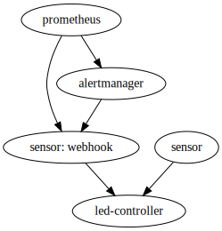

# blinkstick-notifier

Light up specific leds on a [blinkstick strip](https://www.blinkstick.com/products/blinkstick-strip)
and illuminate specific leds with a specified colour when particular events
occur.  Examines Google Calendar and Outlook for calendar events, and examines
Bitbucket for build failures.

## Architecture

All containers send logs to loki and metrics to prometheus.  The prometheus and
alertmanager links to the webhook sensor have been added for emphasis.

Each sensor has it's own links to outside services. For instance, the
`[calendarListener](calendarListener/README.md)` interrogates the google calendar api for a list of
calendar events.  Similarly, the `outlookListener` interrogates the microsoft
graph api for a list of calendar events.  Both sensors send a message to the
led-controller when a meeting is active.

## led-controller

The led-controller is responsible for interacting with the blinkstick.  It
accepts websocket connections, and responds to json messages from sensors.

The controller accepts 4 different objects: a ping message to validate that the
service is working as intended, a handshake message for a sensor to describe
itself to the led-controller, an enable message to turn on a named condition,
and a disable message to turn off a named condition.

More than one sensor can enable the same named condition. When this happens,
the controller will not disable the condition until all sensors have disabled
the condition.

Multiple conditions can be active at the same time.  Each condition has an
explicitly (or automatically) set priority.  For each led, only one colour is
activated.  The highest priority condition specifies the active colour.

## manual-set

The `nginx` container hosts `manualSet.html`, a debugging utility that allows
a developer to enable any named condition.  They can disabled the named
condition that they enabled.

